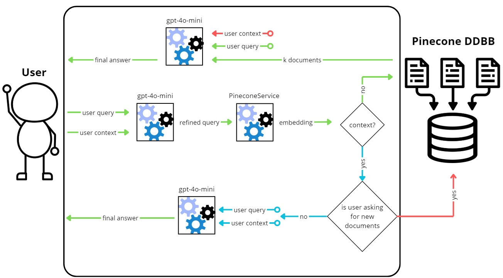

# Academic Research Assistant (RAG Implementation)

An advanced academic research assistant leveraging Retrieval-Augmented Generation (RAG) to provide precise and context-aware answers for researchers. This project integrates OpenAI's language models with Pinecone's vector database to enhance academic queries.

#### Note

The frontend for this project is available at [rag-frontend](https://github.com/nico-mautone/frontend-investigacion-academica).

It consists of an AI generated React frontend that interacts with this API. The reason for this separation is to allow for the frontend to be easily swapped out with a different implementation. Also, as the main focus of this project is the AI model, the frontend is kept simple and minimal using this AI generated frontend.

## Project structure

- **`main.py`**: The main entry point of the FastAPI application.

  - Configures the server, sets up middleware for CORS, and includes routes for RAG queries.

- **`rag.py`**: Contains the core logic for processing user queries and retrieving relevant documents.

- **`openai.py`**: Manages interactions with the OpenAI API for generating responses.

- **`pinecone.py`**: Handles document retrieval using Pinecone's vector database.

- **`prompting.py`**: Builds tailored prompts for different stages of query processing.

- **`config.py`**: Loads and validates environment variables, including API keys for OpenAI and Pinecone.

- **`.env.public`**: Example environment file containing placeholders for API keys.

- **`requirements.txt`**: Lists all dependencies required for the project.

- **Notebooks**:
  - `setting_up_pinecone_database.ipynb`: Guides the setup of Pinecone.
  - `rag_test.ipynb`: Demonstrates the testing of the RAG workflow.

## RAG Workflow



The flow of the Retrieval-Augmented Generation (RAG) system works as follows:

1. **User Input**:

   - The process starts when the **user** sends a query (`user query`).

2. **Refining the Query**:

   - The query is first passed to the `gpt-4o-mini` model (via OpenAI's API), which refines the query by considering the `user context` (The last 10 messages of the conversation) and translates it to English. This step ensures that the query is clear and well-optimized for document retrieval.

3. **Generating Embeddings**:

   - The refined query is then sent to the **PineconeService**, which generates a vector embedding for the query using its embedding service. This embedding represents the query in a numerical format suitable for similarity searches.

4a. **Retrieving Documents**:

   - Only if there is no previous context, the embedding is used to search for similar documents in the **Pinecone Database (DDBB)**. Pinecone retrieves the top-k documents that are most relevant to the refined query.

4b. **Context Validation**:

   - Alternatively, if it has some context when the query is received and maybe could be resolved without accessing the vector database the system checks whether retrieving new documents is necessary:
     - **If new documents are required**, the process fetches and includes them along with the existing context.
     - **If no new documents are needed**, the system skips the retrieval step and works directly with the existing context.

5. **Generating the Final Answer**:
   - The final step involves passing the user query, context, and any retrieved documents to the `gpt-4o-mini` model. The model processes this information and generates a comprehensive response to the user query.
   - This response is then sent back to the user.

## API Reference

#### Query endpoint

```http
POST /query
```

| Parameter | Type     | Description                                             |
| :-------- | :------- | :------------------------------------------------------ |
| `query`   | `string` | **Required**. The research question or topic to query.  |
| `context` | `array`  | Optional. Previous conversation context for continuity. |

**Example Request:**

```json
{
	"query": "I’m doing research on reinforcement learning. Tell me which articles I should start with.",
	"context": []
}
```

**Example Response:**

```json
{
	"answer": "I found several articles that are related to your research on reinforcement learning...."
}
```

## Installation

To set up the project locally:

```bash
python -m venv venv
source venv/bin/activate # On Windows: venv\Scripts\activate
```

Then, go to the `rag-api` directory:

```bash
cd rag-api
pip install -r requirements.txt
```

Within this folder, the OpenAI and Pinecone keys must be included in a `.env` file based on the reference file `.env.public`.

## Running the server

To deploy this project locally:

```bash
fastapi dev main.py
```
